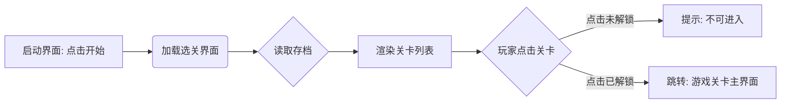

# 关卡选择界面需求文档 (PRD)
文档版本: V1.0 | 对应模块: 关卡选择/进度管理 (Level Select)
前置界面: [启动/主界面] | 后置界面: [游戏关卡主界面]

## 1. 界面整体概述 (Overview)
此界面用于展示游戏的所有关卡节点，并根据玩家的存档记录显示当前的通关进度。玩家在此处选择想要挑战的关卡。

## 2. 详细功能需求 (Functional Specifications)

### 2.1. 界面初始化与进度读取 (Initialization & Save Data)
- **核心逻辑**:
    - **读取存档**: 加载时读取本地/云端存档，获取最高通关记录。
    - **关卡状态**:
        1.  **已通关 (Cleared)**: 已完成，建议显示评价（星级/分数）。
        2.  **当前解锁 (Unlocked/Current)**: 刚解锁未通关，**默认聚焦**此节点。
        3.  **未解锁 (Locked)**: 锁定状态，不可进入。

### 2.2. 关卡节点交互 (Level Node Interaction)
- **点击 [已解锁/已通关]**:
    - **反馈**: 选中音效，按钮缩放。
    - **行为**: 跳转至“游戏关卡主界面”加载配置。
- **点击 [未解锁]**:
    - **反馈**: 禁止音效，节点晃动/锁图标提示。
    - **行为**: 弹出 Tips “请先通过前置关卡”。

### 2.3. 通用 UI 组件 (Common UI)
- **返回按钮 (Back Button)**:
    - **位置**: 左上角/左下角。
    - **功能**: 返回至 [启动/主界面]。

## 3. 界面美术与布局建议 (Visual & Layout)
- **表现形式**: 建议设计成 **“社区地图”** 或 **“楼层电梯”**。
    - 示例: 关卡1(小区门口) -> 关卡2(公园) -> 关卡3(王大爷家)。
- **视觉反馈**:
    - **已解锁**: 亮色，呼吸效果。
    - **未解锁**: 灰色，迷雾/锁链遮挡。

## 4. 流程图示 (Flowchart)

## 5. 开发待确认项 (To Be Clarified)
- **重复游玩**: 建议允许点击旧关卡重刷高分。
- **关卡数量**: 需确认 MVP 版本制作多少关 (决定是列表还是滑动地图)。
- **星级系统**: 是否需记忆星级/评价? (建议 MVP 暂只记录“是否通关”)
